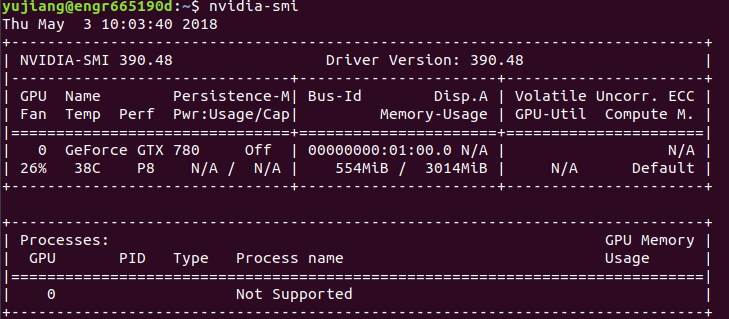
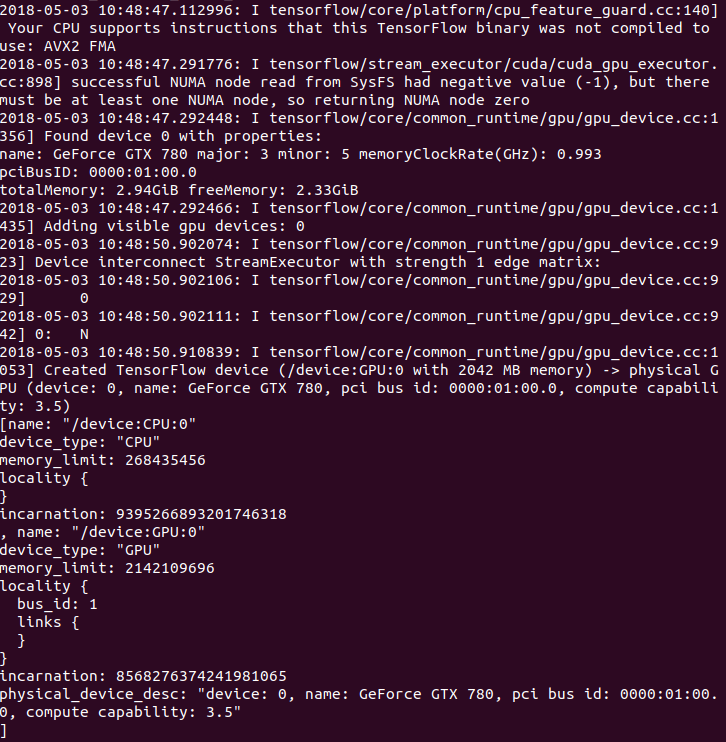

## Install Tensorflow on Ubuntu 18.04 LTS

This instruction documents what I did to install Tensorflow and necessary dependencies on Ubuntu 18.04 LTS. Contents are mostly inspired by the post https://medium.com/@taylordenouden/installing-tensorflow-gpu-on-ubuntu-18-04-89a142325138, but with some modifications that ensures the successful installation. 

**Ubuntu 18.04 installation**

Please follow the official installation guideline or the page here https://linuxconfig.org/how-to-install-ubuntu-18-04-bionic-beaver

**NVIDIA driver installation**

Install a custom version of nvidia driver (if you use the official package, you may need to follow the original post for installing the CUDA 9). 
```shell
$ sudo add-apt-repository ppa:graphics-drivers/ppa
$ sudo apt update
$ sudo apt install nvidia-390
```
Reboot your computer (very important) and check your driver version
```shell
$ nvidia-smi
```
You should see information like this.
<p align="left">
  
</p>

**CUDA9 installation**

Unlike the post, I successfully installed the CUDA9 using the deb file, which is somehow more straightforward than runfile.

Download the CUDA9 toolkit and update patches (for Ubuntu 17.04) throught the official website https://developer.nvidia.com/cuda-90-download-archive?target_os=Linux&target_arch=x86_64&target_distro=Ubuntu&target_version=1704&target_type=deblocal

After downloading, direct to the folder where you save those files.
Use the following commands to install the CUDA9 toolkit
```shell
$ sudo dpkg -i cuda-repo-ubuntu1704-9-0-local_9.0.176-1_amd64.deb
$ sudo apt-key add /var/cuda-repo-<version>/7fa2af80.pub
$ sudo apt-get update
$ sudo apt-get install cuda
```
Use the Ubuntu software installer to install the two update patches (Double-click them as you did on Windows).

**cuDNN installation**

Download the cuDNN v7.0.5 for CUDA 9.0 through the official website https://developer.nvidia.com/rdp/cudnn-archive. Please download the cuDNN v7.0.5 Library for Linux. You need to register as a developer for downloading the files.

Once downloading completes, direct to the folder where the file is saved
unzip the tar file
```shell
$ tar -xvf cudnn-9.0-linux-x64-v7.tgz
$ sudo cp cuda/include/cudnn.h /usr/local/cuda-9.0/include
$ sudo cp cuda/lib64/libcudnn* /usr/local/cuda-9.0/lib64
$ sudo chmod a+r /usr/local/cuda-9.0/include/cudnn.h /usr/local/cuda-9.0/lib64/libcudnn*
```
**libcupti installation**

```shell
$ sudo apt isntall libcupti-dev
```
**Post configuration of CUDA**

Some environment variables need to be configured for the CUDA
Open the '~/.bashrc' file
```shell
$ nano ~/.bashrc
```
Add the following content to the end of the file
```shell
# CUDA configuration
export PATH=/usr/local/cuda-9.0/bin:${PATH:+${PATH}}
export LD_LIBRARY_PATH=/usr/local/cuda-9.0/lib64:${LD_LIBRARY_PATH:+${LD_LIBRARY_PATH}}
```

**Tensorflow installation**

A good thing is that Ubuntu 18.04 LTS supports Python 3.6 in which we can create virtual enviroment naturally. 
Install the venv module for Python 3.6
```shell
$ sudo apt install python3.6-venv
```
Create a python virtual enviroment for tensorflow. I personally prefer the VENV_PATH as ~/tensorflow
```shell
$ python3 -m venv VENV_PATH
```
Activate the virtual environment
```shell
$ source VENV_PATH/bin/activate
```
Install the latest version of Tensorflow
```shell
$ easy_install -U pip
$ pip3 install --upgrade tensorflow-gpu
```
Validate your installation using the code below in the Python virtual environment
```shell
$ python
```
```python
import tensorflow as tf
from tensorflow.python.client import device_lib
device_lib.list_local_devices()

hello = tf.constant('Hello, TensorFlow!')
sess = tf.Session()
print(sess.run(hello))
```
You should see some information like this followed by a string output 'b'Hello, TensorFlow!'
<p align="left">
  
</p>
